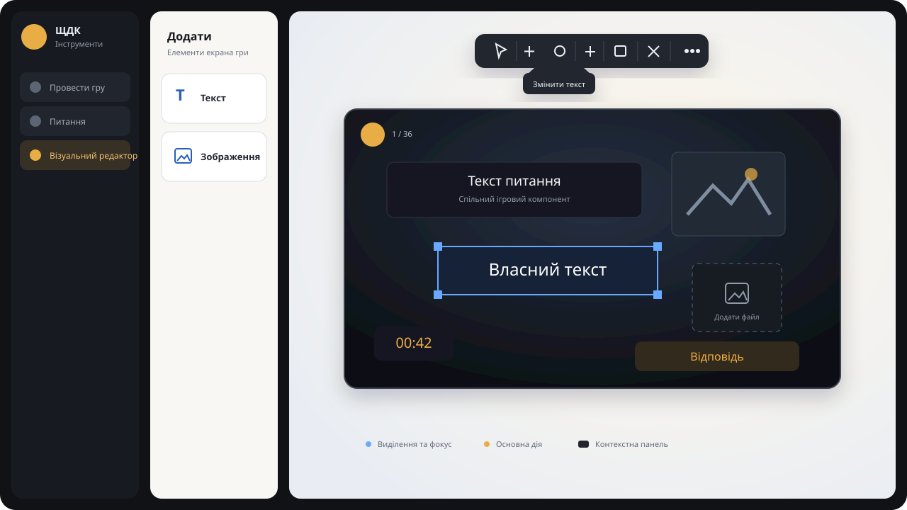

# Visual editor and app-wide UI redesign

Status: implemented

Date: 2026-07-25

Research: [2026 UI and visual-editor research](../research/2026-ui-editor-research-implemented.md)

## Outcome

Create one elegant SCHDK design system across the shell, editor, options, host
setup, and visual editor. Rebuild the visual editor around:

1. a compact icon-only add-element rail on the left;
2. the existing pannable and zoomable game workspace in the center;
3. one compact, icon-only contextual action bar above the canvas;
4. custom text and image elements that persist and render in gameplay.

The host's projected game content keeps its existing dramatic visual identity.
The redesign applies to application chrome and shared controls without turning
the game screen into a generic admin UI.



_Desktop composition. The add palette and contextual action bar are compact,
icon-only controls with custom tooltips._

## Goals

- Make the visual editor understandable without instructions.
- Replace visible labels in action bars with icons and custom tooltips.
- Add editable custom text elements.
- Add custom image elements whose image can be applied, replaced, or removed.
- Apply one tokenized component language across all app surfaces.
- Preserve keyboard access, visible focus, reduced motion, and 320 px support.
- Reuse the current layout math, game-element rendering path, native file
  inputs, Sass, Flexbox, and Font Awesome.

## Non-goals

- Undo/redo history.
- Layers, grouping, locking, alignment guides, templates, or multi-selection.
- Rich text, arbitrary HTML, image filters, cropping, or asset libraries.
- AI-generated layouts or content.
- A Tailwind migration, font download, or animation dependency.
- Saving visual layouts inside `.schdk` packages. Layout remains a local game
  option shared across games, matching current behavior.

## Experience design

### Editor frame

The visual editor fills its shell workspace:

- **Add panel:** fixed compact left icon rail at every width.
- **Workspace:** remaining area, with the 16:9 canvas centered as today.
- **Action bar:** floating above the canvas and centered independently of the
  add panel.

The add panel uses a dark raised surface and a quiet boundary. The workspace
uses a deep ink background with a subtle amber/blue radial wash. The canvas
remains the highest-contrast object.

The add panel stays compact at every width. Its two item buttons use custom
tooltips that explain the element each action adds.

### Add panel

Two icon buttons are shown:

- text icon;
- image icon.

Their accessible labels and custom tooltips explain the element being added.

Adding text:

1. creates a centered text element with `Текст` as its initial value;
2. selects it;
3. opens the text-edit popover and focuses the text field.

Adding an image:

1. creates a centered image placeholder;
2. selects it;
3. opens the native image chooser;
4. keeps the placeholder when the chooser is cancelled, so an image can still
   be applied from the action bar.

New elements use a small positional offset from the previously added custom
element so repeated additions do not fully overlap.

### Contextual action bar

The bar has no heading and no visible action labels. Every action uses:

- a 36 by 36 button;
- a Font Awesome icon;
- a Ukrainian `aria-label`;
- the same Ukrainian label in the shared custom tooltip;
- a clear selected, disabled, focus, and destructive state.

Three or more actions use Base UI `Toolbar` so Tab enters the group once and
arrow keys move between controls.

Context determines the available actions:

| Selection              | Actions                                                                                                            |
| ---------------------- | ------------------------------------------------------------------------------------------------------------------ |
| Canvas                 | Apply/replace background, remove background when present, background opacity                                       |
| Built-in text element  | Typography popover, text color, fit-to-height toggle, grow direction, hide/show in game                            |
| Built-in image element | Image-position popover, hide/show in game                                                                          |
| Custom text            | Edit text, typography popover, text color, fit-to-height toggle, grow direction, hide/show in game, delete element |
| Custom image           | Apply/replace image, remove image, image-position popover, hide/show in game, delete element                       |

Text entry and multi-control settings live in labeled popovers. They are not
placed directly in the toolbar. This keeps the toolbar compact and avoids
arrow-key conflicts.

Deleting a custom element requires no confirmation in the first release:
deletion is a single local preference change and the scope is visually clear.
Adding undo is out of scope, so keyboard `Delete` only removes a custom element
when its wrapper has focus and the event does not originate in a field.

### Tooltips and popovers

Implement one shared `Tooltip` atom backed by Base UI:

- 450 ms initial delay;
- 100 ms delay when moving among actions after one tooltip has opened;
- appears on hover and keyboard focus;
- dismisses on Escape, blur, and pointer exit;
- uses a portal so it is not clipped by editor or shell overflow;
- contains text only.

Use Base UI `Popover` for editable content. Popovers have a visible Ukrainian
heading or field label, trap no focus, return focus to their trigger on close,
and close with Escape or outside click.

## Component-system design

### Dependency

Add `@base-ui/react` to the shared pnpm catalog and to `@schdk/ui`.

Do not add Tailwind, a CSS-in-JS runtime, an animation library, or another icon
set.

### Shared primitives

Keep styling and product-facing APIs in `@schdk/ui`. Base UI remains an
implementation detail.

Add or revise only coherent primitives:

- `Button`: shared sizes, variants, loading/disabled/focus states.
- `IconButton`: Font Awesome icon, accessible label, shared custom tooltip;
  remove native `title`.
- `Tooltip`: Base UI provider, portal, positioning, and motion.
- `ActionToolbar`: Base UI toolbar, groups, and separators.
- `Popover`: shared surface and focus behavior.
- `Field`: common label, description, error, and control spacing.

Use Base UI primitives directly inside composed UI components when no reusable
SCHDK API is needed. Do not create wrappers for every Base UI export.

### Tokens

Expand `_tokens.scss` from color constants into semantic tokens:

- canvas, app, surface, raised, overlay, and hover backgrounds;
- default, muted, inverse, accent, danger, and disabled foregrounds;
- subtle, default, strong, focus, and danger borders;
- brand, interaction, success, pending, saving, and danger states;
- 4/8/12/16/24/32 spacing;
- compact and normal control heights;
- control, panel, and surface radii;
- two elevations;
- type sizes and line heights;
- fast and standard motion;
- focus ring width and offset.

Expose CSS custom properties at the app root for runtime states and keep Sass
variables as aliases while existing SCSS migrates. This avoids a flag-day
rewrite.

### App-wide restyle scope

Apply the tokens and revised primitives to:

- shell sidebar, navigation, home cards, and workspace;
- options tabs, toggles, selects, ranges, and section surfaces;
- package start/drop zone and recent package list;
- question editor header, question navigation, fields, tooltips, dialogs, and
  status states;
- host package summary and non-game controls;
- visual-editor add panel, toolbar, popovers, canvas selection, and placeholders.

Do not replace the host game's gradient question/answer presentation with app
surface styles. Only its shared buttons, focus treatment, and outer host chrome
join the design system.

## Data model

Keep fixed game elements in the existing `GameLayout`. Store user-created
elements separately so fixed IDs and their migration remain simple.
`GameLayoutPosition.hidden` stores whether either kind of element is omitted
from gameplay while remaining available in the editor.

```ts
interface CustomGameElementBase {
  id: string;
  position: GameLayoutPosition;
}

interface CustomTextElement extends CustomGameElementBase {
  kind: 'text';
  text: string;
}

interface CustomImageElement extends CustomGameElementBase {
  kind: 'image';
  image: string | null;
}

type CustomGameElement = CustomTextElement | CustomImageElement;

interface GameOptions {
  soundVolume: number;
  layout: GameLayout | null;
  customElements: CustomGameElement[];
  backgroundImage: string | null;
  backgroundOpacity: number;
}
```

Use `crypto.randomUUID()` for IDs. Reuse `GameLayoutPosition` and the existing
drag, resize, image-position, typography, and fit-to-height behavior. Custom
images are decorative in the first release and render with empty alt text.

Defaults:

- text: 24% width, 10% height, white, centered on canvas;
- image: 24% width, 24% height, centered on canvas;
- both use the existing default presentation values.

Custom elements render above the normal game surface and below controls, and
remain visible through every question stage. The selected editor wrapper stays
above all elements as it does today.

## Persistence and validation

`customElements` is optional when reading old saved options and normalizes to
`[]`.

Validate at the local-storage boundary:

- maximum 20 custom elements;
- unique non-empty IDs;
- known discriminated kind;
- valid existing percentage/presentation position contract;
- text length from 1 to 500 Unicode characters;
- image is `null` or a `data:image/` URL;
- total serialized custom-image data is at most 3 MiB.

Reuse the current background-image file-reading path. Reject non-image files
and oversized persisted media with a visible, actionable error. Change
`saveGameOptions` to report quota/write failure instead of silently accepting
an option update that will disappear after reload.

No IndexedDB asset store is introduced. Add one only if the measured 3 MiB
ceiling prevents real game layouts.

## Rendering flow

1. `ShellView` passes the normalized `GameOptions` to `VisualEditor`.
2. `VisualEditor` renders fixed layout items and `customElements` through one
   shared positioned wrapper.
3. Text uses a small shared `GameCustomText` presentation component.
4. Image uses a small shared `GameCustomImage` component or placeholder.
5. `HostView` passes `customElements` to `GameWizard`.
6. `GameWizard` renders the same presentation components and percentage bounds
   outside question-stage transitions so they remain persistent.

Do not duplicate editor-only previews. The editor and host must use the same
custom text/image presentation components.

## State and interaction changes

Generalize editor selection from `GameLayoutElementId | null` to:

```ts
type VisualEditorSelection =
  | { kind: 'canvas' }
  | { kind: 'built-in'; id: GameLayoutElementId }
  | { kind: 'custom'; id: string };
```

Keep drag and resize state keyed by that selection reference. Extract shared
position updates only after both built-in and custom callers exist.

Escape closes an open tooltip or popover first, then returns selection to the
canvas. Right-button pan and wheel zoom remain unchanged.

## File ownership

Expected implementation touch points:

- `pnpm-workspace.yaml`
- `pnpm-lock.yaml`
- `packages/ui/package.json`
- `packages/ui/src/styles/_tokens.scss`
- `packages/ui/src/atoms/*`
- `packages/ui/src/styles/{shell,editor,host}.scss`
- `packages/ui/src/options/types.ts`
- `packages/ui/src/visual-editor/*`
- `packages/ui/src/host/GameElements.tsx`
- `packages/ui/src/host/GameWizard.tsx`
- `packages/all-web-app/src/options-storage.ts`
- focused tests beside changed behavior

No editor-web or Electron code should be needed. File selection remains a
native renderer input.

## Delivery sequence

1. **Foundation:** Base UI dependency, semantic tokens, Tooltip, IconButton,
   ActionToolbar, Popover, and focused interaction tests.
2. **App-wide chrome:** migrate existing shared buttons, fields, tabs,
   navigation, cards, dialogs, and status surfaces to the token system.
3. **Custom element contract:** types, defaults, normalization, validation, and
   persistence tests.
4. **Visual editor:** add panel, generalized selection, compact contextual bar,
   custom text/image editing, drag, resize, and deletion.
5. **Host parity:** render the same custom elements and presentation settings
   during gameplay.
6. **Verification:** full repository checks, web build, browser interaction at
   320 px and normal desktop width, keyboard-only pass, reduced-motion pass,
   and Electron build because shared renderer resources changed.

Each step should remain buildable. Do not land a second styling system beside
the first and defer migration indefinitely.

## Acceptance criteria

- Every action-bar action is icon-only, has a Ukrainian `aria-label`, and shows
  a custom tooltip on hover and focus.
- Toolbars are keyboard navigable and tooltips dismiss with Escape.
- No actionable target is smaller than 36 by 36 CSS pixels.
- The left add panel creates text and image elements.
- Custom text can be changed and renders identically in the editor and game.
- A custom image can be applied, replaced, removed, and later reapplied.
- Custom elements can be moved, resized, selected, and deleted.
- Every built-in and custom element can be hidden without deletion, remains
  visibly marked and selectable in the editor, and is omitted from gameplay.
- The background remove action is available only while a background exists.
- Layout, content, and images survive reload; invalid or oversized stored data
  falls back safely with an actionable error where user input caused it.
- Legacy options without `customElements` or element visibility still load,
  with missing visibility treated as visible.
- All application chrome uses the shared tokens and primitives.
- The editor works at 320 px and normal desktop width without clipped
  tooltips or unreachable controls.
- `prefers-reduced-motion` removes non-essential transitions.
- Existing package editing, host flow, visual layout, pan/zoom, and game stages
  remain unchanged.

## Required verification

```powershell
pnpm fmt:check
pnpm lint
pnpm typecheck
pnpm test
pnpm --filter @schdk/all-web-app build
pnpm --filter @schdk/all-desktop-app build
```

Also run a real-browser smoke test covering mouse, keyboard, narrow width,
normal width, tooltip boundaries, add/edit/remove flows, reload persistence,
and host rendering.
