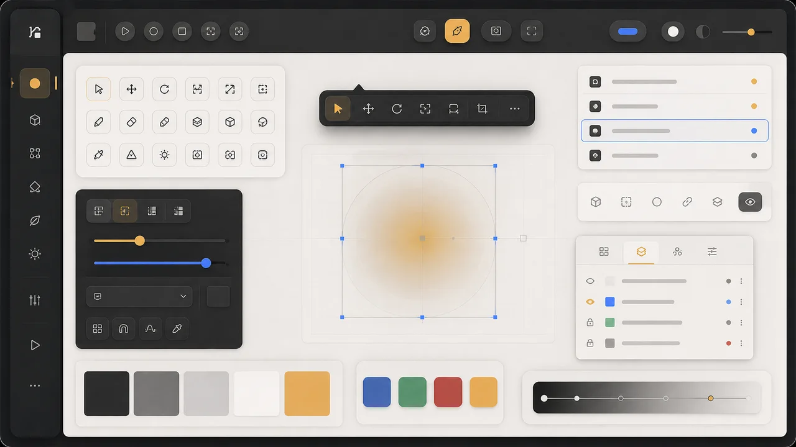

# 2026 UI and visual-editor research

Date: 2026-07-25

## Executive decision

Adopt **Base UI** as the behavior layer for accessible interactive primitives,
keep the existing Sass and Font Awesome stack, and evolve `@schdk/ui` into the
single styled component system for every application surface.

The visual direction should be restrained:

- compact application chrome with generous workspace space;
- warm, soft depth instead of flat gray boxes or heavy glassmorphism;
- one amber brand accent, one blue interaction accent, and semantic state
  colors;
- functional motion only;
- accessible icon-only action bars with custom tooltips;
- visible labels in forms and the add-element palette, where recognition is
  more important than density.

This applies 2026 trends without making a game-authoring tool look like a
marketing site.

_Design-direction moodboard generated for this research. It illustrates the
intended material, density, contrast, and accent hierarchy rather than a
literal application screen._

## Current-state findings

The repository already has the right ownership boundary:

- `@schdk/ui` owns shared components, tokens, SCSS, and composed views.
- `@schdk/all-web-app` owns the persisted editor and game options.
- The host and visual editor already share game-element components.
- The visual editor already stores fixed element bounds as percentages and
  renders them through the host presentation.

The main inconsistencies are:

- `_tokens.scss` has only a small color palette; spacing, type, radii, control
  sizes, shadows, motion, and focus styles are still local literals.
- The shell is dark while the visual editor switches to hard white with a
  separate set of literal colors.
- `Button` is a thin class-composition wrapper and `IconButton` uses the native
  `title` attribute instead of the requested custom tooltip.
- The current visual-editor toolbar mixes a heading, labeled form controls,
  upload controls, and actions in one wrapping strip.
- The layout model is a fixed `Record<GameLayoutElementId, ...>` and cannot
  represent user-created text or image elements.

Relevant implementation locations:

- `packages/ui/src/styles/_tokens.scss`
- `packages/ui/src/atoms/Button.tsx`
- `packages/ui/src/atoms/IconButton.tsx`
- `packages/ui/src/visual-editor/VisualEditor.tsx`
- `packages/ui/src/options/types.ts`
- `packages/all-web-app/src/options-storage.ts`
- `packages/ui/src/host/GameWizard.tsx`

## What the 2026 trend research means here

Elementor's 2026 survey emphasizes organic warmth, reusable design tokens,
functional micro-interactions, accessibility as a default, and leaner,
performance-conscious delivery. Those are useful for SCHDK. Agentic AI,
personalization, storytelling layouts, and decorative 3D are not requirements
for this editor and should not be added.

### Adopt

1. **Semantic tokens**
   Store color, space, type, radius, elevation, motion, and control density as
   named variables. This turns an app-wide restyle into one coherent system
   rather than per-screen CSS changes.

2. **Soft organic depth**
   Use a subtle warm radial wash behind major workspaces, rounded floating
   surfaces, and restrained shadows. Keep the game canvas visually dominant.
   Avoid irregular content layout inside productivity screens.

3. **Functional micro-interactions**
   Use 120-180 ms transitions for hover, focus, tooltip, selection, and panel
   state. Motion must communicate state and honor `prefers-reduced-motion`.

4. **Accessibility-first controls**
   Compact does not mean tiny. Icon buttons should be 36 by 36 CSS pixels,
   comfortably above WCAG 2.2's 24 by 24 minimum target. Tooltips appear on
   hover and keyboard focus, dismiss with Escape, and supplement rather than
   replace `aria-label`.

5. **Lean implementation**
   Reuse native file inputs, color inputs, ranges, and the existing Font
   Awesome icons. Add one headless primitive library, not a second styling
   framework or animation package.

### Do not adopt

- no AI assistant, generated layouts, personalization engine, or analytics;
- no 3D, scroll effects, large ambient animation, or video backgrounds;
- no broad glassmorphism layer that lowers contrast;
- no icon-only forms or unlabeled add-element palette;
- no new font download; use the existing system stack;
- no Tailwind migration solely to obtain pre-styled components.

## Component-library evaluation

| Option           | Fit                                                                                                                                                                              | Decision                                                                                                                                                                        |
| ---------------- | -------------------------------------------------------------------------------------------------------------------------------------------------------------------------------- | ------------------------------------------------------------------------------------------------------------------------------------------------------------------------------- |
| **Base UI**      | Unstyled, accessible, composable, React 17+, works with plain Sass, and includes Tooltip, Toolbar, Popover, Select, Slider, Tabs, Dialog, and related primitives in one package. | **Choose.** It fills behavior gaps while SCHDK keeps visual ownership.                                                                                                          |
| Radix Primitives | Mature accessible, unstyled primitives and incremental adoption.                                                                                                                 | Good fallback, but Base UI provides the same headless approach with a current unified component set and direct Toolbar/Tooltip composition.                                     |
| shadcn/ui        | Broad component catalog and attractive defaults.                                                                                                                                 | Reject for this repository. Its copied-component and Tailwind-oriented workflow would duplicate the existing `@schdk/ui` ownership and Sass system.                             |
| Material UI      | Complete and accessible with a large ecosystem.                                                                                                                                  | Reject. Its opinionated visual and styling system would require overriding a second design system to preserve SCHDK's identity.                                                 |
| Custom-only      | No dependency.                                                                                                                                                                   | Reject for composite widgets. Reimplementing tooltip timing, portal placement, focus behavior, roving toolbar focus, popovers, and dialogs is more code and accessibility risk. |

Base UI supports React 17 and newer, so it is compatible with the repository's
React 19.2 catalog. Because it is unstyled, adopting it does not require
replacing Sass, Flexbox, native inputs, or Font Awesome.

## Icon-only action-bar rules

The user-requested label removal applies to action bars, not every control in
the application.

- Use a familiar Font Awesome icon plus a Ukrainian `aria-label`.
- Render the same label in a custom Base UI tooltip.
- Show on hover and focus after a short delay; dismiss on Escape, blur, or
  pointer exit.
- Keep tooltips non-interactive. Anything with controls is a popover, not a
  tooltip.
- Group three or more actions as a semantic toolbar with arrow-key navigation.
- Use separators only between meaningful action groups.
- Keep destructive actions visually distinct and require confirmation only
  when the loss is not trivially recoverable.
- Keep form labels visible inside popovers, dialogs, settings, and editor
  fields.

## Proposed visual language

- **Application background:** warm graphite rather than pure black.
- **Raised surfaces:** subtly lighter neutral with a low-contrast border.
- **Editor workspace:** light warm gray, not pure white.
- **Brand accent:** current amber, reserved for brand and primary actions.
- **Interaction accent:** blue for selection, focus, and active editing.
- **Radii:** 10 px controls, 14 px panels, 18 px major surfaces.
- **Control density:** 36 px compact icon actions; 40 px normal form controls.
- **Typography:** existing system stack with a clearer 12/14/16/20/28 scale.
- **Elevation:** two shadow levels only.
- **Motion:** 140 ms standard, 180 ms entering surfaces, none when reduced
  motion is requested.

## Sources

- [Elementor: Web Design Trends to Expect in 2026](https://elementor.com/blog/web-design-trends-2026/)
- [Base UI: About](https://base-ui.com/react/overview/about)
- [Base UI: Toolbar](https://base-ui.com/react/components/toolbar)
- [Base UI: Tooltip](https://base-ui.com/react/components/tooltip)
- [Radix Primitives: Introduction](https://www.radix-ui.com/primitives/docs/overview/introduction)
- [shadcn/ui: Components](https://ui.shadcn.com/docs/components)
- [W3C WAI-ARIA APG: Toolbar Pattern](https://www.w3.org/WAI/ARIA/apg/patterns/toolbar/)
- [W3C WAI-ARIA APG: Tooltip Pattern](https://www.w3.org/WAI/ARIA/apg/patterns/tooltip/)
- [W3C WCAG 2.2: Target Size (Minimum)](https://www.w3.org/WAI/WCAG22/Understanding/target-size-minimum)

All web sources were accessed on 2026-07-25.
